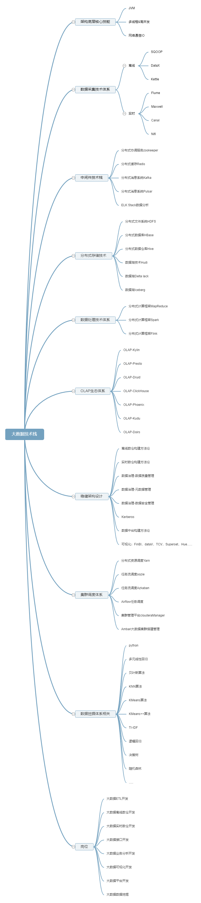

# 大数据相关

## **大数据架构图**

**简介**：提供了大致的大数据系统上的架构图，给初学者一个基本印象，知道一个基本的完整的大数据架构应该是怎样的，作为一个简单了解。

<a href="https://kdocs.cn/l/cpeVA4eWCZDX" target="_blank">点击查看资料</a>

## **Atlas**

**简介**：进行元数据管理，用以构建数据资产目录，形成数据字典。展示表与表、字段与字段之间的血缘关系等。

<a href="https://www.bilibili.com/video/BV1jA411F76d" target="_blank">视频地址</a>

<a href="https://kdocs.cn/l/coufH8iuMIxa" target="_blank">点击查看资料</a>

## **DataX**

**简介**：高效的数据抽取工具，适配多种数据源，相比于sqoop使用简便。

<a href="https://www.bilibili.com/video/BV1H44y1x76X" target="_blank">视频地址</a>

## **CDH**

**简介**：大数据组件部署平台，鉴于大数据需要很多类型的中间件，而这些中间件又需要集群部署，所以整个项目的部署运维工作会非常繁琐，CDH则解决了这样的问题。

<a href="https://www.bilibili.com/video/BV1PT4y1J7nW" target="_blank">黑马视频地址</a>

<a href="https://www.bilibili.com/video/BV19L411r7U5" target="_blank">尚硅谷视频地址</a>

## **HDP**

**简介**：大数据组件部署平台，相比于CDH开源免费，但后续被CDH母公司收购，不再继续更新维护。

<a href="https://www.bilibili.com/video/BV1Uk4y1B75i" target="_blank">视频地址</a>

<a href="https://kdocs.cn/l/cmxk1TWvI3Mi" target="_blank">点击查看资料</a>

## **Kudu**