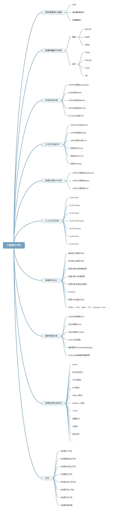

# 大数据相关

## **大数据架构图**

**简介**：提供了大致的大数据系统上的架构图，给初学者一个基本印象，知道一个基本的完整的大数据架构应该是怎样的，作为一个简单了解。

<a href="https://kdocs.cn/l/cpeVA4eWCZDX" target="_blank">点击查看资料</a>

## **Atlas**

**简介**：进行元数据管理，用以构建数据资产目录，形成数据字典。展示表与表、字段与字段之间的血缘关系等。

<a href="https://www.bilibili.com/video/BV1jA411F76d" target="_blank">视频地址</a>

<a href="https://kdocs.cn/l/coufH8iuMIxa" target="_blank">点击查看资料</a>

## **DataX**

**简介**：高效的数据抽取工具，适配多种数据源，相比于sqoop使用简便。

<a href="https://www.bilibili.com/video/BV1H44y1x76X" target="_blank">视频地址</a>

## **CDH**

**简介**：大数据组件部署平台，鉴于大数据需要很多类型的中间件，而这些中间件又需要集群部署，所以整个项目的部署运维工作会非常繁琐，CDH则解决了这样的问题。

<a href="https://www.bilibili.com/video/BV1PT4y1J7nW" target="_blank">黑马视频地址</a>

<a href="https://www.bilibili.com/video/BV19L411r7U5" target="_blank">尚硅谷视频地址</a>

## **HDP**

**简介**：大数据组件部署平台，相比于CDH开源免费，但后续被CDH母公司收购，不再继续更新维护。

<a href="https://www.bilibili.com/video/BV1Uk4y1B75i" target="_blank">视频地址</a>

<a href="https://kdocs.cn/l/cmxk1TWvI3Mi" target="_blank">点击查看资料</a>

## **Kudu**

**简介**：同时支持OLAP和OLTP的大数据库。

<a href="https://www.bilibili.com/video/BV1kv411y7yL" target="_blank">视频地址</a>

<a href="https://kdocs.cn/l/cvbz5FZKUZ0F" target="_blank">点击查看资料</a>

## Kerberos

**简介**：为Hadoop集群提供安全认证管理功能。

<a href="https://www.bilibili.com/video/BV1pV411k7ut" target="_blank">视频地址</a>

<a href="https://kdocs.cn/l/cayv9hywZSS7" target="_blank">点击查看资料</a>

<a href="https://kdocs.cn/l/cprTrWpcrEwr" target="_blank">Kerberos概念图</a>

## Oozie

**简介**：早期大数据任务调度管理工具，但其实最好用的是海豚。

<a href="https://www.bilibili.com/video/BV1KA411e7iB" target="_blank">视频地址</a>

<a href="https://kdocs.cn/l/cjez6p1xgGl2" target="_blank">点击查看资料</a>

## Azkaban

**简介**：早期大数据任务调度管理工具，但其实最好用的是海豚。

<a href="https://www.bilibili.com/video/BV1DK4y1v7Ns" target="_blank">视频地址</a>

<a href="https://kdocs.cn/l/ckyuWstoiQDw" target="_blank">点击查看资料</a>

## Impala

**简介**：对Hadoop做查询增强使用，可以在Hadoop基础上很方便的编写SQL进行数据处理。

<a href="https://www.bilibili.com/video/BV1AK411M7Gg" target="_blank">视频地址</a>

<a href="https://kdocs.cn/l/cnDzHigwVIxU" target="_blank">点击查看资料</a>

## Sqoop

**简介**：早期数据抽取工具。现在基本上都用DataX。

<a href="https://www.bilibili.com/video/BV1vV411U7wU" target="_blank">视频地址</a>

<a href="https://kdocs.cn/l/cfu0efgwmc0n" target="_blank">点击查看资料</a>

## Nifi

**简介**：大数据任务调度管理工具，NSA（美国国家安全局）出品，因在国内社区不太广泛，所以现在都用海豚。

<a href="https://www.bilibili.com/video/BV1GT4y1g7kJ" target="_blank">视频地址</a>

## DeltaLake

**简介**：数据湖工具，与spark一家公司出品，结合起来很好用。

<a href="https://www.bilibili.com/video/BV18z4y1f7JY" target="_blank">视频地址</a>

## Cassandra

**简介**：开源分布式NoSQL数据库，早期作为数仓使用。

<a href="https://www.bilibili.com/video/BV1aQ4y1Z7Nj" target="_blank">视频地址</a>

<a href="https://kdocs.cn/l/crAo8nJb7aSq" target="_blank">点击查看资料</a>

## Canal

**简介**：模仿成为MySQL的从库，实时同步数据使用，经常用作实时数仓、redis数据一致等场景使用。

<a href="https://www.bilibili.com/video/BV1aL4y1E7Tb" target="_blank">视频地址</a>

## Flume

**简介**：日志抽取工具。

<a href="https://www.bilibili.com/video/BV1Cy4y1t7gT" target="_blank">视频地址</a>

<a href="https://kdocs.cn/l/cckc9wAuyd1Q" target="_blank">点击查看资料</a>

## Hbase

**简介**：支持随机查询的高性能列式数据库。

<a href="https://www.bilibili.com/video/BV14y4y1r7yK" target="_blank">视频地址</a>

# Flink

**简介**：实时/离线计算工具，与spark类似。

<a href="https://www.bilibili.com/video/BV1Gt4y1z7bR" target="_blank">视频地址</a>

## Spark

**简介**：实时/离线计算工具。

<a href="https://www.bilibili.com/video/BV1Jq4y1z7VP" target="_blank">视频地址</a>

<a href="https://kdocs.cn/l/cbLr7MTwl1PM" target="_blank">点击查看资料</a>
